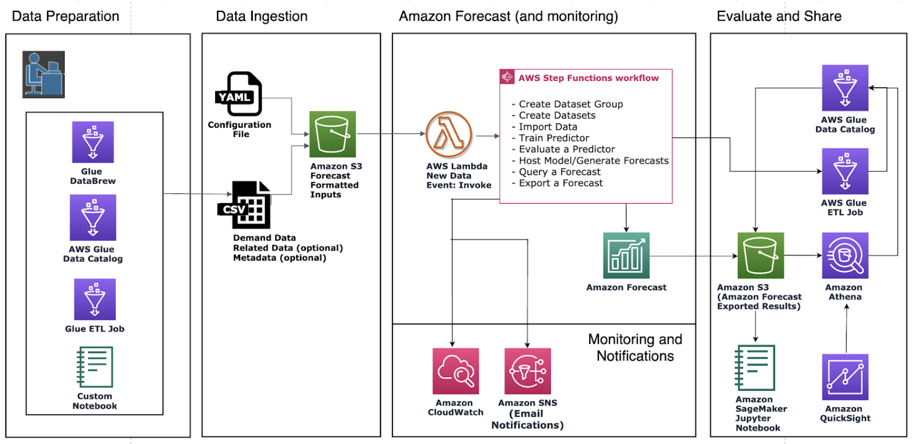

<h2 align="left">
  
  AWS CloudFormation
</h2>

Pense no CloudFormation como um “orquestrador” de infraestrutura.
Você escreve um arquivo no formato YAML ou JSON que descreve a infraestrutura desejada — esse arquivo é chamado de modelo (template).
💡 Com esse modelo, o CloudFormation pode recriar o mesmo ambiente quantas vezes quiser, com total consistência.
📘 Ele segue o conceito de Infrastructure as Code (IaC) — infraestrutura tratada como código, o que facilita controle de versão, auditoria e reuso.

  

---

## 🚀 Componentes principais

O CloudFormation trabalha com três elementos principais:

1️⃣ Template (modelo)

É o arquivo de configuração (em YAML ou JSON) que descreve os recursos a serem criados.
2️⃣ Stack (pilha)

É a implantação prática do template — ou seja, o conjunto real de recursos criados a partir dele.
📦 Quando você cria uma stack, o CloudFormation lê o template e provisiona tudo automaticamente.

3️⃣ Change Set (conjunto de alterações)

Antes de aplicar mudanças em uma pilha existente, o CloudFormation mostra um resumo do que será alterado — útil para evitar erros.
---

## 🧭 Como funciona a automação

-O processo de automação com CloudFormation segue estas etapas:
-Definir o template — descreva os recursos (EC2, VPC, S3, IAM, Forecast, etc.).
-Carregar o modelo no CloudFormation Console ou CLI.
-Criar a pilha (stack) — o CloudFormation lê o modelo e provisiona tudo.
-Gerenciar automaticamente — ele cuida de dependências, ordem de criação e rollback em caso de falha.
-Excluir a pilha — tudo é removido automaticamente, evitando sobras de recursos.

---

## 🧩 Vantagens da automação com CloudFormation

 Reprodutibilidade: você pode recriar o mesmo ambiente em qualquer região ou conta AWS.
 Padronização: todos os recursos seguem o mesmo modelo, sem erros manuais.
 Escalabilidade: é fácil criar múltiplos ambientes (dev, test, prod) com o mesmo código.
 Segurança: permite controle de permissões via IAM.
 Rollback automático: se algo falhar, ele reverte todas as alterações.
 Integração com outros serviços AWS: como CodePipeline, Step Functions, Lambda, ECS e Forecast.

---

## 🔗 Integrações com outros serviços da AWS

O CloudFormation se integra facilmente com outros serviços da AWS para automação avançada:

| Serviço                | Função principal                                          |
| ---------------------- | --------------------------------------------------------- |
| **AWS CodePipeline**   | Automatiza o deploy contínuo de templates.                |
| **AWS Lambda**         | Executa ações personalizadas durante a criação de stacks. |
| **Amazon Forecast**    | Cria pipelines de previsão automatizados.                 |
| **Amazon ECS / EKS**   | Cria clusters e containers automaticamente.               |
| **AWS Step Functions** | Orquestra fluxos de automação com múltiplas stacks.       |

---

## 🧠 Casos de uso práticos

Imagine que você quer implantar automaticamente um pipeline de previsão no Amazon Forecast.
Com CloudFormation, basta executar um modelo pronto que:

### 1️⃣ Cria um bucket no S3 com os dados de entrada.

### 2️⃣ Configura o Amazon Forecast com esses dados.

### 3️⃣ Inicia automaticamente o pipeline de previsão.

### 4️⃣ Cria permissões IAM e logs de execução.

Sem CloudFormation, isso exigiria vários passos manuais.
Com ele, tudo é feito em minutos e de forma repetível.

---

## 💬 Conclusão

O AWS CloudFormation é essencial para quem busca automatizar a criação de ambientes na AWS com segurança, consistência e rapidez.
Com ele, você transforma infraestrutura em código, reduz erros humanos e acelera o ciclo de desenvolvimento e implantação.

👉 [Acesse a documentação completa da AWS Step Functions](https://docs.aws.amazon.com/pt_br/forecast/latest/dg/tutorial-cloudformation.html)
